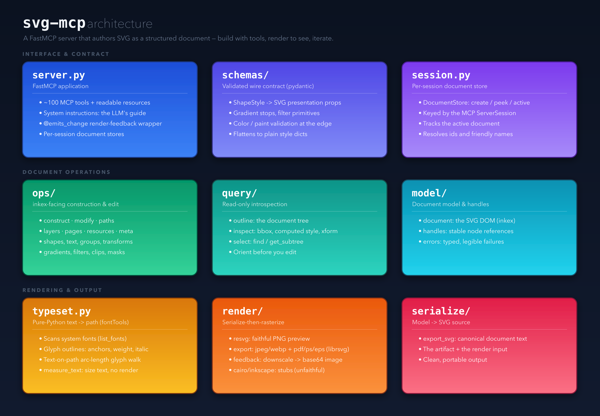
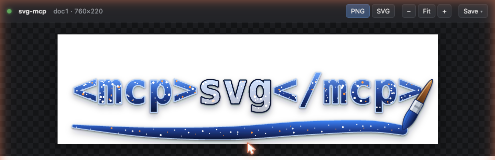

<p align="center">
  
</p>

# svg-mcp

A [FastMCP](https://github.com/jlowin/fastmcp) server that exposes **structured, hierarchical
SVG authoring** to an LLM — all primitives, gradients/patterns, paths, text-on-path, embedded
raster, reusable styles — built around an **inkex-backed document model** the AI can navigate,
query, and manipulate as groups, layers, transforms, and masks, with a fast
**construct → render → see → iterate** loop.

> The logo above was authored entirely through these tools — see [Usage](#usage).

See [`DESIGN.md`](./DESIGN.md) for the full architecture and the
[`INKEX_PRIMITIVES.md`](./INKEX_PRIMITIVES.md) catalog for the inkex → tool mapping.

## Quickstart (Claude)

1. **Prerequisites** — just **Python ≥ 3.12**. Rendering happens **in-process** (the
   [resvg](https://github.com/linebender/resvg) engine ships as the `resvg-py` dependency), so
   there's no separate renderer to install. *Optionally*, install the resvg **CLI** for a small
   per-render speedup — it's used automatically when on `PATH`:

   ```bash
   brew install resvg          # OPTIONAL (macOS; or: cargo install resvg)
   ```

    **Linux build headers.** On macOS the install is pure wheels. On Linux, two dependencies —
    **lxml** and **PyGObject** (the latter pulled in by `inkex`) — sometimes have **no matching
    wheel** for a recent interpreter and are compiled from source by pip, which needs C headers.
    Install them up front (see [System packages (Linux)](#system-packages-linux) for the full
    per-library mapping and other distros). On **Debian 13 (trixie) / Ubuntu**:

    ```bash
    sudo apt-get install build-essential python3-dev pkg-config \
        libxml2-dev libxslt1-dev libglib2.0-dev \
        libgirepository-2.0-dev gir1.2-girepository-2.0 libcairo2-dev
    ```

2. **Install.** You need [uv](https://docs.astral.sh/uv/) — install it first if you don't have it
   ([docs](https://docs.astral.sh/uv/getting-started/installation/)):

   ```bash
   curl -LsSf https://astral.sh/uv/install.sh | sh   # macOS / Linux
   # alternatives: brew install uv  ·  pipx install uv  ·  winget install astral-sh.uv (Windows)
   ```

   **Easiest — no clone.** `uvx` fetches svg-mcp and **all** its dependencies (including the
   in-process renderer) into a cached, isolated environment and runs it — nothing to manage:

   ```bash
   uvx svg-mcp --help                                                # once published to PyPI
   uvx --from "git+https://github.com/georgeharker/svg-mcp" svg-mcp  # before PyPI / track main
   ```

   Use that command as the MCP server command in step 3 (then skip the rest of this step).

   <details>
   <summary><b>Alternative: install from a clone (for development)</b></summary>

   Pick **one** of two install layouts — this choice decides the path you point Claude at:

   **a) Project-local venv (recommended, self-contained).** Creates `./.venv` inside the repo and
   installs svg-mcp editable into it — nothing touches your other environments:

   ```bash
   uv sync                             # → ./.venv with svg-mcp + deps (from pyproject/uv.lock)
   # equivalently, without uv.lock:  uv venv && uv pip install -e .
   # no uv at all:                   python -m venv .venv && .venv/bin/pip install -e .
   ```

   → entrypoint: **`./.venv/bin/svg-mcp`** (absolute: `$(pwd)/.venv/bin/svg-mcp`).

   **b) Into your own existing venv.** Activate the venv you want first, then install editable:

   ```bash
   source /path/to/your/venv/bin/activate      # or otherwise have VIRTUAL_ENV set
   uv pip install -e .                          # or: pip install -e .
   ```

   → entrypoint: **`/path/to/your/venv/bin/svg-mcp`**.

   > ⚠️ **`uv sync` always targets the project's `./.venv`**, but **`uv pip install` / `pip
   > install` target whichever venv is currently active.** If you already have one active, svg-mcp
   > **and its dependencies** (fastmcp, inkex, fontTools, numpy, Pillow, …) get installed into it.
   > Use option (a) — or an explicit fresh venv — unless you deliberately want it in an existing
   > environment.

   </details>

3. **Connect Claude** — point it at the **entrypoint path from step 2** (`./.venv/bin/svg-mcp`
   for option a, or `/path/to/your/venv/bin/svg-mcp` for option b; always use the **absolute**
   path in configs):

   - **Claude Code** — from the repo directory (option a shown):

     ```bash
     claude mcp add svg-mcp -- "$(pwd)/.venv/bin/svg-mcp"
     ```

     (Or just open the project — it ships a [`.mcp.json`](./.mcp.json) you can approve.)

   - **Claude Desktop** — add to `claude_desktop_config.json` and restart the app:

     ```json
     { "mcpServers": { "svg-mcp": { "command": "/ABSOLUTE/PATH/TO/<venv>/bin/svg-mcp" } } }
     ```

4. **Try it** — ask Claude:

   > Use svg-mcp to make a 320×120 badge that says "hello" on a blue gradient, then show me the
   > render.

   Claude creates a document, adds the shapes and text, and calls `render_document` to show you
   the image inline — then you iterate in plain language ("bigger text", "add a drop shadow",
   "outline the text to paths"). See [Usage](#usage) for the conventions and a worked example.

## Status

The full inkex catalog is mapped through to **109 MCP tools** (see
[`INKEX_PRIMITIVES.md`](./INKEX_PRIMITIVES.md)), with ruff/mypy clean and the test suite green.

- **Document model** (inkex-backed, multi-document with an active-document default): shapes,
  paths (+ arc/star factories and path-data ops), text + tspan runs + text-on-path + flowed
  text, images (base64/file embed), groups (+ ungroup, z-order, duplicate, world-preserving
  reparent), **layers** (+ visible/locked/opacity), symbols/use, hyperlinks.
- **Text → paths** (`text_to_path`): pure-Python glyph outlining (fontTools) — flattens tspans,
  honors bold/italic/per-run fill, and walks text **along a curve** (`<textPath>`). `list_fonts`
  enumerates installed families; `measure_text` returns a run's width/height from font metrics so
  you can fit and center text **without a render round-trip**.
- **Variable-width strokes** (`add_variable_width_path`): SVG has no native variable stroke-width,
  so swelling/tapering lines — calligraphy, engraving, brushes, tapered arrows — are expanded into
  a filled ribbon, with butt/round caps and optional **cubic** (Catmull-Rom) smoothing of both the
  path and the width.
- **Squircles** (`add_squircle`/`edit_squircle`): rounded rectangles with iOS/Figma **corner
  smoothing** — Apple's continuous-corner app-icon shape, where edges ease into the corner arc with
  cubic Béziers instead of meeting it abruptly. A `smoothness` 0–1 param (0 = plain rounded rect,
  ~0.6 = Apple-icon look, 1 = maximally smooth); stored parametrically for re-editing.
- **Bulk constructors** (`add_rects`/`add_circles`/`add_lines`/`add_paths`/
  `add_variable_width_paths`): add many shapes in one call (one round-trip) — for procedural art,
  hatching/engraving fields, and data viz.
- **Import** existing SVG (`import_svg`, inline or from a file) into a session document to render,
  inspect, or edit.
- **Reusable resources**: named styles (CSS classes + `@name` paint refs), linear/radial/mesh
  gradients, patterns, markers, **clip + mask**, and **filters** (blur, drop-shadow,
  color-matrix/overlay, blend, morphology, component-transfer, turbulence, displacement, plus a
  raw filter-graph builder).
- **Transforms** as primitives: translate, rotate-about-center, scale-about-anchor, skew, raw.
- **Queries / context**: `current_context`, `describe_node`, `list_resources`, `outline`, bbox,
  computed style, transform/CTM, unit conversion, selectors (`find`/`get_subtree`), image
  extraction; metadata (title/desc/RDF); guides & pages.
- **Render-and-see loop**: serialize-then-rasterize via the **resvg** engine — in-process by
  default (bundled `resvg-py`), or the CLI when present; the image is handed back directly as
  base64 image content. Documents are also published as readable MCP **resources**
  (`svg://documents`, `svg://{id}/svg`, `svg://{id}/render`) with change notifications.
- **File export** (`export_render`): faithful raster (png/jpeg/webp via resvg) and **true vector**
  (pdf/ps/eps via librsvg). cairo is intentionally avoided — it silently drops SVG filters (a drop
  shadow renders blank), so it is not faithful to the document.

## Architecture

<p align="center">
  
</p>

> Authored entirely through the svg-mcp tools and rendered via the server's resvg backend
> ([`docs/architecture.svg`](./docs/architecture.svg) is the live serialized source).

Three layers: an **interface & contract** tier (the FastMCP server, pydantic input schemas, and
per-session document stores), a **document-operations** tier (inkex-facing construction/edit,
read-only introspection, and the document model), and a **rendering & output** tier (pure-Python
typesetting, the render/export backends, and SVG serialization). See [`DESIGN.md`](./DESIGN.md)
for the full layering rationale.

## Install

```bash
pip install -e ".[dev]"
```

### System packages (Linux)

macOS installs entirely from wheels — nothing extra. On Linux, pip falls back to building a
couple of dependencies **from source** whenever no wheel matches your interpreter (common on
**Debian 13 “trixie”** and other recent/edge distros), and those builds need C headers and
build tooling. Which library needs what:

| Python dependency | Why | Debian/Ubuntu packages |
|---|---|---|
| (all C-extension builds) | compiler, headers, `pkg-config` | `build-essential` · `python3-dev` · `pkg-config` |
| **lxml** | the XML/XSLT C libs it binds | `libxml2-dev` · `libxslt1-dev` |
| **PyGObject + pycairo** (both pulled in by `inkex` on Linux) | GObject-introspection (`girepository`) **and** the cairo C lib (PyGObject depends on pycairo) | `libgirepository-2.0-dev` · `gir1.2-girepository-2.0` · `libcairo2-dev` (drag in `libglib2.0-dev`) |
| **pangocffi / pangocairocffi** (`cairo` extra only) | the pango C lib (cairo is already covered above) | `libpango1.0-dev` · `libffi-dev` |

Core install (everything except the optional `cairo` extra) on **Debian/Ubuntu** — verified on
Debian 13 (trixie):

```bash
sudo apt-get install build-essential python3-dev pkg-config \
    libxml2-dev libxslt1-dev \
    libglib2.0-dev libgirepository-2.0-dev gir1.2-girepository-2.0 \
    libcairo2-dev
```

> On trixie the **GObject-introspection** dev package is the new **`libgirepository-2.0-dev`**
> (it pulls in `libglib2.0-dev`); on older releases it is `libgirepository1.0-dev`. Likewise
> the XSLT headers are `libxslt1-dev` (the bare `libxslt-dev` name is only a virtual alias).

If you also install the **`cairo` extra** (`pip install -e ".[cairo]"`), add pango (cairo is
already in the core set above):

```bash
sudo apt-get install libpango1.0-dev libffi-dev
```

Equivalents on other distros (same libraries, distro-specific names):

```bash
# Fedora / RHEL
sudo dnf install gcc python3-devel pkgconf-pkg-config \
    libxml2-devel libxslt-devel \
    gobject-introspection-devel glib2-devel cairo-devel \
    pango-devel libffi-devel                    # last line = cairo extra
# Arch
sudo pacman -S base-devel libxml2 libxslt gobject-introspection cairo \
    pango libffi                                # pango/libffi = cairo extra
```

If pip instead finds wheels for every dependency on your platform/interpreter, none of the
above is needed — the build-from-source fallback is the only thing that pulls these in.

### inkex (the SVG DOM)

Depends on the released **PyPI `inkex>=1.4.1`**. Note its API shape (verified against the
install): `inkex.colors` is a flat module, and there is **no `Image.embed_image()`** — raster
embedding is done manually (base64 data URI). All element classes plus `bounding_box`,
`composed_transform`, `specified_style`, and `Transform @` composition are present.

### resvg (the default renderer)

resvg is a deterministic, cross-platform renderer with native text-on-path and broad filter
support and no system libs. It renders **in-process** via the bundled **`resvg-py`** binding
(same engine — verified pixel-identical to the CLI), so a bare install is self-contained with no
external binary.

If the resvg **CLI** is on `PATH` it's used automatically instead — marginally faster, entirely
optional:

```bash
brew install resvg          # OPTIONAL (macOS; or: cargo install resvg)
```

Override the CLI path with `SVG_MCP_RESVG_BINARY=/path/to/resvg`, or force a backend with
`SVG_MCP_RENDERER=resvg-py` (in-process) / `resvg-cli`. Vector export (`pdf/ps/eps`) still needs
the librsvg `rsvg-convert` binary; raster output never does.

### Optional backends

- `cairo` extra — secondary vector/raster backend (PDF/PS/SVG out) via cairocffi + pango;
  needs the cairo + pango system libs (macOS: Homebrew `cairo` + `pango`; Linux: see
  [System packages (Linux)](#system-packages-linux)). Stub today.
- Headless Inkscape — reference renderer + heavy ops, driven via `--shell` (no D-Bus on
  macOS). Stub today.

## Configuration

All settings are env vars prefixed `SVG_MCP_` (or a `.env` file):

| Var | Default | Meaning |
|---|---|---|
| `SVG_MCP_RENDERER` | `resvg` | Render backend: `resvg` (CLI if present, else in-process) · `resvg-py` · `resvg-cli` · `cairo` · `inkscape` |
| `SVG_MCP_RESVG_BINARY` | auto | Path to the resvg CLI |
| `SVG_MCP_INKSCAPE_BINARY` | auto | Path to the Inkscape CLI |
| `SVG_MCP_FEEDBACK_MAX_EDGE` | unset | Optional long-edge cap (px); unset = raw image handed back directly as base64 |
| `SVG_MCP_DEFAULT_BACKGROUND` | transparent | Default render background (CSS color) |
| `SVG_MCP_RENDER_TIMEOUT_S` | `30` | Per-render subprocess timeout |
| `SVG_MCP_TRANSPORT` | `stdio` | Server transport: `stdio` · `http` · `streamable-http` · `sse` |
| `SVG_MCP_HOST` / `SVG_MCP_PORT` | `127.0.0.1` / `8000` | Bind address for the http transports |
| `SVG_MCP_PREVIEW` | unset | Auto-start the [live preview](#live-preview) web server on boot (`1`/`true`) |
| `SVG_MCP_PREVIEW_HOST` / `SVG_MCP_PREVIEW_PORT` | `127.0.0.1` / `8808` | Bind address for the live preview |

Transport, host, and port can also be set with CLI flags (which take precedence over the env
vars): `svg-mcp --transport streamable-http --host 127.0.0.1 --port 7731`.

## Develop

```bash
pytest          # tests (resvg smoke test auto-skips if the binary is absent)
ruff check .    # lint
mypy src        # types (no Any / object — precise types only)
```

## Run

```bash
svg-mcp                                          # FastMCP server over stdio (default)
svg-mcp --transport streamable-http --port 7731  # or streamable HTTP at 127.0.0.1:7731/mcp
# env vars work too: SVG_MCP_TRANSPORT=http SVG_MCP_PORT=7731 svg-mcp
```

A long-running HTTP server is handy for a shared/persistent endpoint a bridge can connect to
(the server runs as a single process; each client connection gets its own isolated documents).

## Live preview

Rendering each step back into the chat costs tokens and, in a terminal, the model sees the image
but you don't. The live preview solves both: a tiny loopback web page that mirrors the active
document and **auto-refreshes on every edit** over Server-Sent Events — so you watch the drawing
build in a browser while the model keeps working, with no render bytes spent on the conversation.

<p align="center">
  
</p>

- **Start it:** ask the model to *"show me"* (or *"open a preview"*) and it calls the
  `start_preview` tool, then hands you the URL. Or set `SVG_MCP_PREVIEW=1` to auto-start on boot.
- **Watch it:** open the URL once and leave it — it repaints on each change. Toggle **PNG**
  (faithful resvg output) vs **SVG** (crisp vector), zoom, drag to pan, and **Save** the current
  frame as PNG/SVG/WebP/JPEG/PDF straight from the page.
- **Per-chat:** the URL carries a session token (`/<token>/`), so each chat gets its own isolated
  preview even though they share one server and port — one chat's edits never appear in another's.

The page just mirrors the read-only [`svg://` resources](#resources): `GET /<token>/active/render`
is the same render as the `svg://{id}/render` resource, refreshed by the same change signal.

## Experiment with an LLM

Quickest sanity check (no LLM): render a sample poster to PNG.

```bash
.venv/bin/python scripts/demo.py            # writes demo_output.png
```

**Claude Code** — this repo ships a project [`.mcp.json`](./.mcp.json); open the project and
approve the `svg-mcp` server, or add it explicitly:

```bash
claude mcp add svg-mcp -- /Users/geohar/Development/svg-mcp/.venv/bin/svg-mcp
```

**Claude Desktop** — add to `claude_desktop_config.json`:

```json
{
  "mcpServers": {
    "svg-mcp": { "command": "/Users/geohar/Development/svg-mcp/.venv/bin/svg-mcp" }
  }
}
```

**MCP Inspector** — interactively call tools and view rendered images in a browser:

```bash
uv run fastmcp dev src/svg_mcp/server.py:mcp
```

The model's loop is: `create_document` → add nodes / resources → `render_document` to see the
result inline → iterate → `export_svg`. The server's `instructions` describe the full workflow
and conventions; each tool carries its own description.

## Usage

The tools are called by an LLM over MCP. The core loop is **create → build → render-and-see →
iterate → export**. A minimal session (arguments shown as the JSON each tool receives):

```text
create_document(width=320, height=120)                 # → {document_id:"doc1", active:true}

# define a reusable gradient, then paint with it by name (@name) or url(#id)
define_linear_gradient(x1=0, y1=0, x2=1, y2=0,
    stops=[{offset:0, color:"#7dd3fc"}, {offset:1, color:"#1e3a8a"}], name="brand")
add_rect(x=0, y=0, width=320, height=120, rx=16, style={fill:"@brand"})

add_text(x=160, y=72, content="svg-mcp", name="title",
    style={font_family:"Helvetica", font_size:"40px", font_weight:"bold",
           text_anchor:"middle", fill:"#ffffff"})
apply_drop_shadow(target="title", dx=0, dy=2, blur=3, color="#000", opacity=0.4)

render_document(scale=2)        # returns the rendered PNG inline — look, then adjust
export_svg()                    # final SVG source string
```

### Conventions

- **Active document.** `create_document` returns a `document_id` and makes it active; you may
  **omit `document_id`** on later calls to target it. Pass it explicitly to switch, or use
  `set_active_document`. Call `current_context()` to re-anchor (active id, open docs, outline).
- **Targets by id or name.** Every `target`/`parent`/`content` arg takes a node's returned id
  **or** the friendly `name` you gave it. Name things you'll revisit; reason via `find(name=…)`
  and `outline`. **Names should be unique** — a name matching several nodes is rejected (no silent
  guess); disambiguate with a hierarchy path `ancestor/name` (each segment an id or name) or the
  id. Each chat/connection has its own isolated set of documents (`current_context` reports the
  `session_id`).
- **Stacking.** Later siblings paint on top. Restack relative to a sibling with
  `reparent(target, above=<node>)` / `below=<node>` instead of counting child indices.
- **Coordinates.** User units, origin top-left, y increases downward.
- **Style.** A structured object — `fill`, `stroke`, `stroke_width`, `opacity`, plus typography
  (`font_family`, `font_size`, `font_weight`, `font_style`, `text_anchor`). Colors accept hex /
  `rgb()` / CSS names / `none`, **or** a paint reference `url(#id)` / `@name` to a defined
  gradient or pattern.
- **Resources** follow *create → define → reference/apply*: `define_*` returns an id you use as
  a fill (`url(#id)`/`@name`) or attach via `apply_*` (clip/mask/marker/filter). Clip/mask/
  symbol/pattern definitions **move** the listed content nodes into the resource, so build those
  shapes first. `list_resources()` shows what's defined.
- **Transforms** compose: `translate_node`, `rotate_node` (optional center), `scale_node`
  (optional anchor), `skew_node`, or `apply_transform("rotate(45 100 100)")`.
- **Text.** `add_text` + `add_text_run` for multi-line/styled spans; `add_text_on_path` to flow
  along a path. Judge text size with `render_document` (geometry queries are empty for live
  text). `text_to_path` outlines text to glyph paths — **font-independent**, flattens tspans,
  and walks `<textPath>` along its curve; `list_fonts` lists installable families.

### Resources

Open documents are also exposed as readable MCP resources, so a host can surface live state:
`svg://documents` (index + which is active), `svg://{id}/svg` (source), `svg://{id}/render`
(PNG). Mutations emit `resources/updated` notifications.

### Example: the logo

The header logo (`logo.svg`) was built with these tools — `<mcp>svg</mcp>` as a blue gradient
wordmark, an orange→white starfield clipped into the glyphs, the inner `svg` word under a
translucent white veil (so the `<mcp>` tags read as starry space and `svg` as frosted white), all
under one drop shadow — then `text_to_path` outlined the glyphs so the final file is
font-independent. `scripts/demo.py` shows a smaller end-to-end build you can run directly.

## License

**GPL-2.0-or-later.** svg-mcp's document model is built on [inkex](https://pypi.org/project/inkex/)
(the Inkscape extensions library), which is **GPL-2.0-or-later** — a strong copyleft license that
extends to works that import it. svg-mcp is therefore licensed under the GNU General Public License
v2 or later; see [`LICENSE`](./LICENSE).
