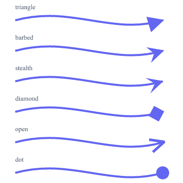

# Cookbook

Practical, copy-pasteable recipes. Each step is an MCP tool call; arguments are shown as
`name=value`. The shapes behind the [Gallery](gallery.md) are all reproduced here.

## The core loop

svg-mcp is a *render-and-see* tool. The rhythm is always:

1. `create_document(width, height)` → returns a `document_id` and makes it the **active** document
   (so you can omit `document_id` afterwards).
2. Add content (`add_squircle`, `add_path`, `add_text`, …). Each returns the new node's
   `{id, tag, name}` — keep the `id`, or pass a `name` to refer back by name.
3. `render_document(scale=…)` to **see** the result, then adjust. For a window the user can watch
   live, call `start_preview` once and hand them the URL — it refreshes on every change.
4. `export_render(format=…)` to save (png/jpeg/webp/pdf/ps/eps/svg), or `export_svg` for the source.

> **Naming tip.** A `@name` paint shorthand resolves by name, so don't give a gradient and a shape
> the *same* name — reference the gradient by its returned `url(#id)` (or use distinct names).

## Parametric shapes

```
create_document(width=620, height=180)
add_squircle(x=20, y=30, width=120, height=120, radius=34, smoothness=0.6, style={fill:"#6366f1"})
add_rounded_polygon(cx=240, cy=90, radius=64, corner_radius=18, sides=6, style={fill:"#10b981"})
add_superellipse(cx=400, cy=90, rx=64, ry=52, exponent=4, style={fill:"#f59e0b"})
add_pill(x=480, y=62, width=120, height=56, style={fill:"#ef4444"})
```

`smoothness` (0–1) controls corner smoothing on squircle/rounded_polygon/pill; `exponent` controls
the superellipse silhouette. Each is re-editable later, e.g. `edit_squircle(target, radius=50)`.

## A boolean cutout (even-width bezel)

The headline icon trick: subtract an inner squircle from an outer one to get a perfectly even ring.

```
outer = add_squircle(x=10, y=10, width=120, height=120, radius=34, smoothness=0.6, style={fill:"#1e293b"})
inner = add_squircle(x=24, y=24, width=92,  height=92,  radius=26, smoothness=0.6, style={fill:"#000"})
boolean(op="difference", targets=[outer, inner], name="bezel")
```

`union`, `intersection`, and `exclusion` work the same way. The first target is the subject; the
rest are operands and are consumed into the result.

## Concentric rings & insets with offset_path

```
base = add_squircle(x=40, y=40, width=220, height=220, radius=56, smoothness=0.6,
                    style={fill:"none", stroke:"#334155", stroke-width:3})
# grow outward (+) and inset (−); each returns a new node beside the original
offset_path(target=base, distance=24)    # → restyle stroke to taste
offset_path(target=base, distance=-26)
```

For a squircle/pill/rounded-polygon the offset is **exact** and stays a parametric shape; for any
other path it's an analytic Bézier offset (`join` = round/miter/bevel).

## Soft glows (offset + blur)

```
ring = … (some shape)
glow = offset_path(target=ring, distance=20)         # grow the silhouette
restyle(target=glow, style={fill:"#67e8f9", stroke:"none", opacity:0.9})
apply_blur(target=glow, std_deviation=24)
reparent(target=glow, below=ring)                    # tuck it behind the crisp art
```

`apply_drop_shadow` is a one-call alternative for offset shadows.

## Calligraphic variable-width strokes

```
add_variable_width_path(
  points=[[30,150],[130,60],[230,150],[330,60],[430,150]],
  widths=[3, 26, 6, 26, 3],         # full stroke width at each vertex (or one number for uniform)
  interpolation="cubic",            # Catmull-Rom smoothing of both path and width
  cap="round",
  style={fill:"#7c3aed"})
```

The result is a filled ribbon (set `style.fill`, not stroke). Use `closed=true` for an annular
ribbon.

## Arrowheads & endpoint markers

{width=360}

`define_arrow_marker` builds a head from a preset; `apply_marker` attaches it to a path/line/curve.
The marker is `orient="auto"` (rotates to the path's direction) and scales with the stroke width, so
an arrow on a curve points along the tangent at its tip.

```
head = define_arrow_marker(preset="barbed", color="#6366f1")   # also: triangle/stealth/diamond/open/dot
line = add_path(d="M30,120 C120,60 220,160 300,90",
                style={fill:"none", stroke:"#6366f1", stroke-width:4})
apply_marker(target=line, marker=head, position="end")          # or "start" / "mid"
```

For a fully custom head, build the shapes yourself and use `define_marker(content=[…])` instead.

## Duplicate & restyle

```
card = add_squircle(x=10, y=10, width=80, height=80, radius=16, style={fill:"#ef4444"})
duplicate(target=card, style={fill:"#3b82f6"})   # a clone, recolored, still an editable squircle
```

`duplicate` deep-copies the subtree (descendants get fresh ids) and preserves parametric specs.
For many instances that update together, use `define_symbol` + `add_use`.

**Restyle one node, or many in one call.** `restyle` merges by default (only the props you pass
change; `replace=true` swaps the whole style). Pass `edits` to apply different styles to many nodes
in a single round-trip — ideal for a wholesale recolor/gloss pass:

```
restyle(target="card", style={stroke:"#000", stroke-width:2})    # single (merge)
restyle(edits=[                                                   # batch — one call
  {target:"bezel", style:{fill:"url(#sheen)"}},
  {target:"dot1",  style:{fill:"#ef4444", opacity:0.8}},
  {target:"dot2",  style:{fill:"#10b981"}, replace:true},
])
```

For styles reused across many nodes, prefer a **named style**: `define_style("chip", {…})` +
`apply_styles(target, ["chip"])`, then `edit_style("chip", {…})` (merge) updates every node wearing
it at once; `delete_style("chip")` removes the class.

## Gradients & export

```
g = define_linear_gradient(x1=0, y1=0, x2=0, y2=1,
      stops=[{offset:0, color:"#7c3aed"}, {offset:1, color:"#3b82f6"}])
add_squircle(x=0, y=0, width=512, height=512, radius=115, style={fill:"url(#"+g+")"})
export_render(format="png")          # or pdf/jpeg/webp/svg
```
