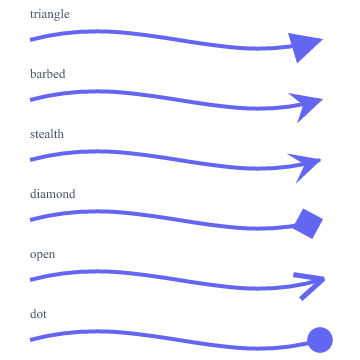

# Cookbook

Practical, copy-pasteable recipes. Each step is an MCP tool call; arguments are shown as
`name=value`. The shapes behind the [Gallery](gallery.md) are all reproduced here.

## The core loop

svg-mcp is a *render-and-see* tool. The rhythm is always:

1. `create_document(width, height)` → returns a `document_id` and makes it the **active** document
   (so you can omit `document_id` afterwards).
2. Add content (`add_squircle`, `add_path`, `add_text`, …). Each returns the new node's
   `{id, tag, name}` — keep the `id`, or pass a `name` to refer back by name.
3. `render_document(scale=…)` to **see** the result, then adjust. For a window the user can watch
   live, call `start_preview` once and hand them the URL — it refreshes on every change. Do this
   up front on anything non-trivial, without waiting to be asked, so they can steer as you build.
4. `export_render(format=…)` to save (png/jpeg/webp/pdf/ps/eps/svg), or `export_svg` for the source.

> **Naming tip.** A `@name` paint shorthand resolves by name, so don't give a gradient and a shape
> the *same* name — reference the gradient by its returned `url(#id)` (or use distinct names).

## Parametric shapes

```
create_document(width=620, height=180)
add_squircle(x=20, y=30, width=120, height=120, radius=34, smoothness=0.6, style={fill:"#6366f1"})
add_rounded_polygon(cx=240, cy=90, radius=64, corner_radius=18, sides=6, style={fill:"#10b981"})
add_superellipse(cx=400, cy=90, rx=64, ry=52, exponent=4, style={fill:"#f59e0b"})
add_pill(x=480, y=62, width=120, height=56, style={fill:"#ef4444"})
```

`smoothness` (0–1) controls corner smoothing on squircle/rounded_polygon/pill; `exponent` controls
the superellipse silhouette. Each is re-editable later, e.g. `edit_squircle(target, radius=50)`.

## A boolean cutout (even-width bezel)

The headline icon trick: subtract an inner squircle from an outer one to get a perfectly even ring.

```
outer = add_squircle(x=10, y=10, width=120, height=120, radius=34, smoothness=0.6, style={fill:"#1e293b"})
inner = add_squircle(x=24, y=24, width=92,  height=92,  radius=26, smoothness=0.6, style={fill:"#000"})
boolean(op="difference", targets=[outer, inner], name="bezel")
```

`union`, `intersection`, and `exclusion` work the same way. The first target is the subject; the
rest are operands and are consumed into the result.

## Concentric rings & insets with offset_path

```
base = add_squircle(x=40, y=40, width=220, height=220, radius=56, smoothness=0.6,
                    style={fill:"none", stroke:"#334155", stroke-width:3})
# grow outward (+) and inset (−); each returns a new node beside the original
offset_path(target=base, distance=24)    # → restyle stroke to taste
offset_path(target=base, distance=-26)
```

For a squircle/pill/rounded-polygon the offset is **exact** and stays a parametric shape; for any
other path it's an analytic Bézier offset (`join` = round/miter/bevel).

## Soft glows (offset + blur)

```
ring = … (some shape)
glow = offset_path(target=ring, distance=20)         # grow the silhouette
restyle(target=glow, style={fill:"#67e8f9", stroke:"none", opacity:0.9})
apply_blur(target=glow, std_deviation=24)
reparent(target=glow, below=ring)                    # tuck it behind the crisp art
```

`apply_drop_shadow` is a one-call alternative for offset shadows.

## Calligraphic variable-width strokes

```
add_variable_width_path(
  points=[[30,150],[130,60],[230,150],[330,60],[430,150]],
  widths=[3, 26, 6, 26, 3],         # full stroke width at each vertex (or one number for uniform)
  interpolation="cubic",            # Catmull-Rom smoothing of both path and width
  cap="round",
  style={fill:"#7c3aed"})
```

The result is a filled ribbon (set `style.fill`, not stroke). Use `closed=true` for an annular
ribbon.

## Arrowheads & endpoint markers

{width=360}

`define_arrow_marker` builds a head from a preset; `apply_marker` attaches it to a path/line/curve.
The marker is `orient="auto"` (rotates to the path's direction) and scales with the stroke width, so
an arrow on a curve points along the tangent at its tip.

```
head = define_arrow_marker(preset="barbed", color="#6366f1")   # also: triangle/stealth/diamond/open/dot
line = add_path(d="M30,120 C120,60 220,160 300,90",
                style={fill:"none", stroke:"#6366f1", stroke-width:4})
apply_marker(target=line, marker=head, position="end")          # or "start" / "mid"
```

For a fully custom head, build the shapes yourself and use `define_marker(content=[…])` instead.

## Duplicate & restyle

```
card = add_squircle(x=10, y=10, width=80, height=80, radius=16, style={fill:"#ef4444"})
duplicate(target=card, style={fill:"#3b82f6"})   # a clone, recolored, still an editable squircle
```

`duplicate` deep-copies the subtree (descendants get fresh ids) and preserves parametric specs.
For many instances that update together, use `define_symbol` + `add_use`.

**Restyle one node, or many in one call.** `restyle` merges by default (only the props you pass
change; `replace=true` swaps the whole style). Pass `edits` to apply different styles to many nodes
in a single round-trip — ideal for a wholesale recolor/gloss pass:

```
restyle(target="card", style={stroke:"#000", stroke-width:2})    # single (merge)
restyle(edits=[                                                   # batch — one call
  {target:"bezel", style:{fill:"url(#sheen)"}},
  {target:"dot1",  style:{fill:"#ef4444", opacity:0.8}},
  {target:"dot2",  style:{fill:"#10b981"}, replace:true},
])
```

For styles reused across many nodes, prefer a **named style**: `define_style("chip", {…})` +
`apply_styles(target, ["chip"])`, then `edit_style("chip", {…})` (merge) updates every node wearing
it at once; `delete_style("chip")` removes the class.

## Gradients & export

```
g = define_linear_gradient(x1=0, y1=0, x2=0, y2=1,
      stops=[{offset:0, color:"#7c3aed"}, {offset:1, color:"#3b82f6"}])
add_squircle(x=0, y=0, width=512, height=512, radius=115, style={fill:"url(#"+g+")"})
export_render(format="png")          # or pdf/jpeg/webp/svg
```

## Themes: load, author, restyle

```
load_theme("blueprint")                      # routes what the manifest declares; returns guidance
add_diagram_node(kind="service", label="API")     # already dressed — no style args
add_text(x=20, y=30, content="Q3 review", role="title")   # say what it IS; theme paints it
set_theme_variant("dark"); reflow()          # reskin everything linked; re-bake edge-label halos
apply_theme(target="legacy-group", theme="blueprint")     # dress an EXISTING subtree
sync_theme("blueprint")                      # picked up after you edit the theme's styles.css
```

A theme is a directory of real CSS (see [themes.md](./themes.md)); `list_styles()` is the
menu. Inline `style` args stay pinned through all of it — if you typed it, it sticks.

## Diagrams, charts & annotations: zero coordinates

```
a = add_diagram_node(kind="service",   label="API Gateway")
b = add_diagram_node(kind="datastore", label="Postgres")
add_diagram_edge(source=a.id, target=b.id, kind="data", label="reads/writes")
add_diagram_container(members=[a.id, b.id], kind="zone", label="backend")
layout_diagram(algorithm="layered", direction="LR")       # places everything, reflows

add_chart(kind="bar", data={categories:["Q1","Q2"], series:[{name:"2026", values:[51,62]}]},
          title="Revenue")                                 # ticks/margins derived from data
add_legend()                                               # generated from what the doc uses
add_callout(target=b.id, text="hot shard — see runbook", kind="warning")
```

Moved something by hand? `reflow()` — edges re-route, callout leaders re-anchor, fitted
containers re-fit. Editing data? `edit_chart`/`edit_table`/`edit_diagram_*` patch the spec
and re-derive; the node keeps its id, classes, and position.

## Diagram a call graph in one call

Already have the graph? Don't transcribe it — `add_diagram_graph` takes the shape a code-index
or dependency export already emits (`from`/`to`, extra keys ignored).

```
add_diagram_graph(
  nodes=[{id:"src/ops/chart.py", symbols:315}, {id:"src/ops/diagram.py", symbols:178},
         {id:"src/ops/graph.py",  symbols:69}, {id:"src/model/document.py", symbols:32},
         {id:"src/model/errors.py", symbols:6}, {id:"src/model/__init__.py", symbols:1}],
  edges=[{from:"src/ops/chart.py",  to:"src/ops/diagram.py",    weight:21},
         {from:"src/ops/chart.py",  to:"src/model/document.py", weight:27},
         {from:"src/ops/graph.py",  to:"src/ops/diagram.py",    weight:4},
         {from:"src/model/document.py", to:"src/model/errors.py", weight:5}],
  collapse=[{id:"model", label:"model (document · errors)", kind:"datastore",
             members:["src/model/document.py", "src/model/errors.py"]}],
  exclude=["*/__init__.py"],
  size_field="symbols", scale_width=[120, 260], scale_height=[40, 96],
  layout="layered", direction="TB")
# → {nodes_created:4, edges_created:3, groups_created:1, nodes_collapsed:2,
#    self_edges_dropped:1, nodes_filtered:1, mapping:{…}, bounds:[20, 20, 476, 261], …}
resize_document(mode="fit", margin=20)
```

The `document.py → errors.py` edge is now *inside* the group, so it becomes a self-edge and is
**dropped and counted** — nothing is silently lost. `size_field` reads a key your export already
carries; scaling **both** dimensions maps each by the square root, so the box's *area* carries the
count (and never shrinks below its label). A graph decides its own size, so check `bounds` and let
`resize_document(mode="fit")` shrink-wrap the canvas to it. Every node keeps its graph id as its
name, so `add_callout(target="src/ops/diagram.py", …)` resolves straight afterwards.

## Pin what matters, route the rest

`layout_diagram` moves **every** node in scope. Two spec fields opt individual things out — and
they survive re-derivation, because they are part of the spec rather than the drawn geometry.

```
hsm = add_diagram_node(kind="external", label="HSM", x=40, y=300, pinned=true)   # rack position
api = add_diagram_node(kind="service",  label="API")
add_diagram_edge(source=api.id, target=hsm.id, kind="control", label="sign",
                 waypoints=[[220, 180], [220, 320]])      # this edge IS the picture
layout_diagram(algorithm="layered", direction="LR")       # everything else gets placed
translate_node(target=api.id, dx=0, dy=-40)
reflow()                                                  # re-route from where things are NOW
```

What survives what: `pinned` keeps **both** of the node's coordinates through `layout_diagram`,
which packs the drawing around it — but its **rank is still computed from its edges**, so a node
pinned far from where its rank lands gets edges that double back. Pinning anything also anchors
the whole scope to that pin: it is no longer normalized onto `origin_x`/`origin_y`. `waypoints`
pin the route's **middle** — the ends keep following the nodes' faces — through every later
`reflow` *and* `layout_diagram`, but they do **not** pin the nodes: lay out again and the boxes
move while the route stays. `edit_diagram_edge(waypoints=[…])` replaces a pinned route wholesale;
`waypoints=[]` clears the pin and hands the edge back to the router. Everything unpinned is
routed down the lanes the layout reserves — and those lanes are **not stored**, so a bare
`reflow()` re-routes long edges direct: run `layout_diagram` again for lanes, or pin the one
route you care about.
