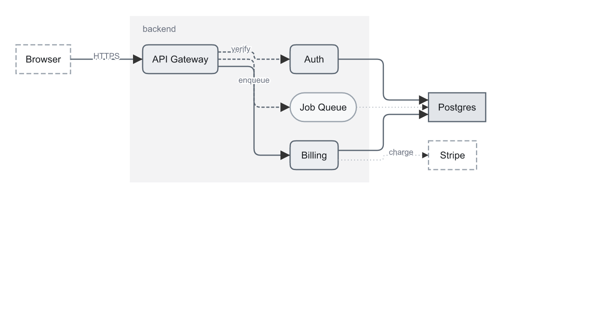
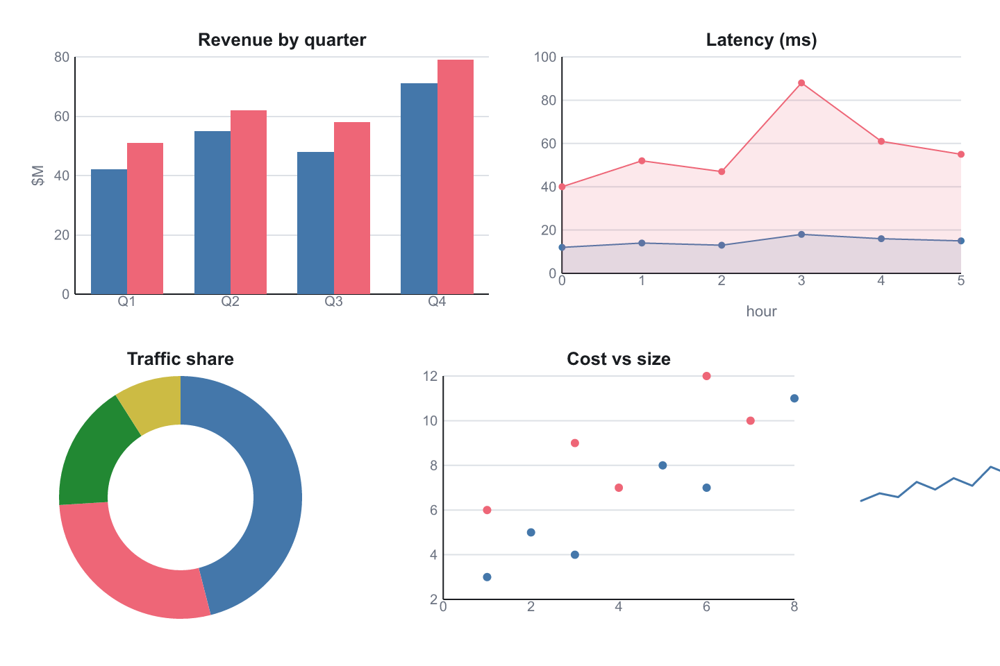
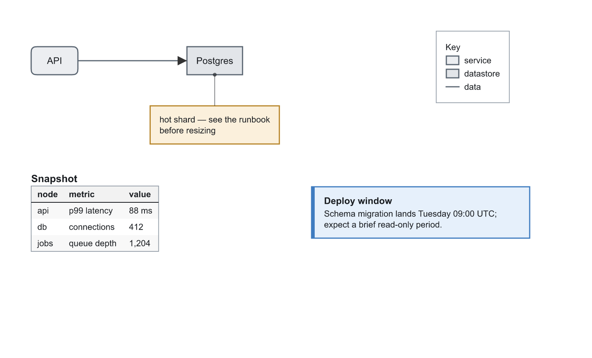

# Diagrams, charts & annotations — declare, don't draw

The facades in this page share one idea: **you state what things are and how they relate;
geometry is derived.** Every facade is a group carrying its spec in a `data-*` attribute
(`get_params` reads it back), styled through the [theme system](./themes.md), and editable
after the fact — nothing is baked that can't be re-derived.

The zero-coordinate happy path:

```
api = add_diagram_node(kind="service",   label="API Gateway")
db  = add_diagram_node(kind="datastore", label="Postgres")
add_diagram_edge(source=api.id, target=db.id, kind="data", label="reads/writes")
add_diagram_container(members=[api.id, db.id], kind="zone", label="backend")
layout_diagram(algorithm="layered", direction="LR")
```



## Nodes

`add_diagram_node(kind, label, ...)` — the serving theme's `[kinds]` manifest picks the
shape (service → squircle, queue → pill, decision → diamond, ...); the box sizes itself to
its label plus the theme's `--pad-node`; omitted positions stack below the previous node.
Built-in kinds: `service`, `datastore`, `queue`, `external`, `decision`, `note` — themes
add more by declaring a role and a `[kinds]` entry.

## Edges

`add_diagram_edge(source, target, kind, route, label)` — edges store **what they connect,
not where they run**. Sides are chosen from the geometry (`auto`) or named (`N/S/E/W`);
several edges sharing a face fan out across it instead of piling on one point; routes are
`orthogonal` (right angles, rounded elbows), `straight`, or `spline`; labels sit on the
longest segment with a canvas-colored halo. Built-in kinds: `data` (solid), `control`
(dashed), `dependency` (dotted).

## Containers

`add_diagram_container(members, kind, label)` — a box drawn *behind* its members (a
sibling, not a parent: nothing is reparented). Fitted automatically around the members
plus `--pad-container` and label headroom, or fixed by giving all of x/y/width/height.
Kinds: `cluster`, `zone`, `swimlane`.

## reflow — the one call after you move things

```
translate_node("db", dx=60, dy=0)
reflow()
```

`reflow()` re-routes every edge, re-anchors every callout leader, and re-fits every
fitted container from current positions. It is **explicit by design** — moves stay local
operations, and nothing rearranges behind your back. Edges/callouts whose target vanished
are reported, not guessed at.

## layout_diagram — opt-in automatic placement

`layout_diagram(algorithm, direction)` places every diagram node in scope, then reflows:

- `layered` (default) — Sugiyama: cycle-safe ranking, crossing-minimized orders, coordinates
  by the **priority method** (the most connected node in a rank gets the position it wants and
  shoves the rest along, so busy paths come out straight and depth adds no drift), nodes
  sharing a container kept adjacent. For flows and architectures.
- `tree` — parents centered over children. For genuine hierarchies.
- `grid` — document order into rows. Ignores edges.

A layout pass moves **every** node in scope — hand placement is preserved by *not* calling it,
or, one node at a time, by `add_diagram_node(pinned=true)` / `edit_diagram_node(pinned=true)`.
A pinned node keeps **both** coordinates and `layered` packs the rest of the drawing around it
as an immovable wall. Its rank is still computed from its edges, so a node pinned far from
where its rank lands gets edges that double back. Pinning anything also anchors the drawing to
that pin: the scope is no longer normalized onto `origin_x`/`origin_y`.

## Charts

`add_chart(kind, data, ...)` — data-parametric presentation charts: `bar` (plain/grouped),
`line` (points/area options), `donut`, `scatter`, `histogram`, `sparkline`. Ticks land on the 1/2/5
ladder; margins are **measured from the actual tick labels**; series take the theme's
`--series-1..8` palette in order. `edit_chart` replaces the data and re-derives the whole
picture while the group keeps its id, classes, and position.



### Axes

`axes=` is one optional argument carrying everything about the frame. Omit it and a chart
draws exactly what it always drew.

| field | what it does |
| --- | --- |
| `y_min` / `y_max` | Pin the value axis — the way two charts are made comparable. Either alone works; the other end stays derived. Data outside a pinned range is **clipped** to the plot rect (a `clipPath` on the series groups), so a bar can't spill past the axis it's measured against. Pinning an end also suppresses the automatic zero-inclusion at that end. |
| `x_min` / `x_max` | The same for a numeric x (`line`/`scatter`). Ignored where x is categorical. |
| `scale` | `"linear"` (default) or `"log"`. A log axis needs strictly positive data *and* limits — a non-positive value is an error naming it. Ticks fall on decade boundaries, subdivided 1/2/5 while the span is under about two decades. **Bars on a log scale measure from the axis minimum, not from zero**, because there is no zero to measure from. |
| `ticks` / `x_ticks` | A target count, or the exact values to tick at. Values outside the range are dropped, not refused. |
| `tick_format` / `x_tick_format` | `{style, decimals, prefix, suffix, thousands}` with `style` one of `plain`, `percent` (×100, owns the `%`), `currency` (`prefix` or `$`), `si` (k/M/G/T, m/µ/n below 1), `fixed`. A **closed vocabulary** — an arbitrary format string is how an axis ends up with five identical labels. |
| `gridlines` | `"y"` (default), `"x"`, `"both"`, `"none"`. |
| `minor` / `minor_gridlines` | How many minor ticks to put **between** each pair of majors (`4` → five intervals), and whether to draw gridlines at them (fainter, `.gridline-minor`). Minor tick *marks* need `tick_marks` and come out half its length (`.tick` + `.tick-minor`). On a **log** scale the count is ignored: the minor positions are the classic 2..9 mantissas of each decade. Minor gridlines follow the same `gridlines` selection as the majors. |
| `tick_marks` | Length in px of a mark at each tick; they participate in the measured margins. |
| `tick_direction` | `"out"` (default), `"in"`, `"inout"`. The margins reserve room for the **outward** part only — an inward tick is drawn in space the plot already owns. |
| `x_tick_rotate` | Degrees; negative reads bottom-left to top-right. The bottom margin grows to the turned label's real extent. Turns whatever is on the **bottom** axis — the categories normally, the values on horizontal bars. |
| `y_tick_rotate` | The same for the **left** axis; the left margin grows to the turned label's horizontal extent. |
| `invert_x` / `invert_y` | Run a scale backwards. It lives inside the `Scale`, so bars, washes, reference lines and the clip rect all turn with it — bars still grow from their baseline, which is now at the other end of the plot. `invert_x` is ignored where x is categorical. |
| `zero_spine` | When 0 is inside the value range, draw the category axis **line** at 0 instead of along the plot's edge. The tick labels and tick marks **stay at the edge** — a deliberate divergence from matplotlib's moved spine, which drags the ruler into the middle of the data. |
| `reference_lines` | Thresholds and bands: `[{value, axis, label, to, kind}]`. A **line** (no `to`) is drawn over the data — a threshold has to read across what it judges — and a **band** (`to` set) behind it. `axis` is the *data* axis: `"y"` is the value axis however the bars are turned, `"x"` the numeric x of a line/scatter (dropped where x is categorical). A line off the axis is dropped silently; a band clamps to it. `kind` names the role class (`.reference` by default). |

### Per-kind options

| option | on | what it does |
| --- | --- | --- |
| `marker` / `marker_size` | line, scatter | circle, square, diamond, triangle, tri_down, plus, cross, star, none. Deliberately eight, not forty. `plus`/`cross` have no area: they are stroked paths wearing the series class, which is why every `.series-N` sets a stroke as well as a fill. |
| `open` | line, scatter | Draw the marks unfilled — the B/W-safe second encoding, and what keeps overlapping marks countable. `plus`/`cross` are stroked either way. |
| `markevery` | line | A mark on every nth point (from the first). The line stays complete; only the marks thin out. |
| `sizes` / `marker_scale` | line, scatter | The bubble channel. `sizes` is one number per point (validated against the point count). With `marker_scale=[min_r, max_r]` they are quantities mapped across the whole chart's observed range **by area** (radii go as the square root); without it they are radii in user units. Value labels clear the actual per-point radius. |
| `bands` | line | `[{between: [seriesA, seriesB], label}]` — a filled region between two of this chart's own series, drawn **behind** every line in the first named series' colour at 0.15 fill-opacity. v1 requires the two series to share an identical x sequence (loudly refused otherwise): filling between differently-sampled lines would interpolate readings nobody took. The label goes at the band's widest vertical gap. |
| `waterfall` / `total_label` | bar | Float each bar from the running total — one series only, never stacked. Dashed `.waterfall-connector` rules join each bar's end to the next one's start. `total_label` appends a final bar from zero to the net total, wearing **series-2** so it reads as a different kind of statement. Works with `value_labels` (the signed step) and with `orientation="horizontal"`. The running total follows the **drawn** order, so an `order` moves the arithmetic with it. |
| `normalized` | bar | Requires `stacked`. Scales each category's stack to 100 — shares, not sizes; the denominator is the sum of absolute values so a stack that crosses zero still spans 100. It pairs with a percent-ish `tick_format` but sets none for you: the values are 0..100, so write them with `fixed` + a `%` suffix. |
| `bins` | histogram | A **count** of equal-width bins across the data's range, or the explicit ascending **edges** (n edges → n-1 bins). Bins are half-open `[lo, hi)` with the last one closed, so an observation on an edge belongs to the bin above it and the largest value is still counted. A degenerate range becomes one bin of width `max(1, |v| × 0.1)` centred on the value. The bars are contiguous — a gap would be a range nothing fell in. No density, no cumulative, no KDE. |
| `hatch` | bar, donut, line area | Diagonal fill in each series' own colour, so print and greyscale keep them apart. |
| `last_point` / `extremes` / `baseline` | sparkline | Dots on the last / lowest+highest value; a reference line across the trend. |
| `value_labels` | bar, line, scatter | Write each datum's value on its mark, formatted by `value_format` or else by the axis's own `tick_format`. Bars label just outside the bar's end and **flip inside** when the plot edge is too close; line/scatter label above the mark (below it at the top of the plot). Labels live outside the clip, so a pinned axis can never cut one in half. |
| `slice_labels` | donut | Name + value outside each slice; a slice too thin to label at the rim gets a 6px radial stub. The ring shrinks by the measured label width to make room. |
| `value_format` | bar, line, scatter, donut | A `TickFormat` for the value labels alone. |
| `orientation` | bar | `"horizontal"` runs the value axis along x and the categories down the **left margin — which is then measured from the category names**, the whole reason to turn a bar chart on its side. |
| `stacked` | bar | Sum the series within each category (they share one band; it wins over side-by-side). Positives stack up from zero, negatives **down** from zero on their own running total. The axis is scaled to the **totals**. Segment labels go in the segment's centre and are omitted when it is too short to hold them. Not available on a log scale — a stack is a sum measured from a zero a log axis hasn't got. |
| `stack_total_labels` | bar | Each stack's total, just beyond the end of it. |
| `order` | bar, donut | `"given"`, `"value_desc"`, `"value_asc"`, `"label"`, or an explicit `[str]` of category/slice names (unnamed ones keep their given place after the named; an unknown name is an error naming it). `value_*` ranks by the **first** series, or by the total when stacked. |
| `step` | line | `"pre"`/`"post"`/`"mid"` — a staircase instead of a slope (`post` holds then rises; `mid` changes halfway between the two readings, which is what to draw when the number describes a period). The area wash and any `bands` follow the same outline; the marks stay on the real readings. |
| `center_text` / `center_subtext` | donut | The KPI idiom: a big number in the hole and a caption under it. |
| `start_angle` | donut | Degrees from 3 o'clock, clockwise. Default -90 = 12 o'clock. |

A **population pyramid** is the horizontal bar chart plus one negated series: two series, one
of them entered as negatives, `orientation="horizontal"` — the bars mirror about zero, and
`zero_spine` puts the axis line down the middle of them.

Deliberately out of scope: density/cumulative/KDE on a histogram (binning is arithmetic; a
kernel is a parameter that changes the shape of the answer), other statistical transforms,
multiple/secondary axes, colormaps —
data that doesn't fit a tool-call argument belongs to a plotting library; `import_svg` its
output instead.

## Annotations

- `add_legend()` — **generated** from what the document actually uses: node, edge, and
  container kinds plus chart series, each swatch wearing its real theme class (edge kinds
  draw as lines with their true dash patterns). A variant switch recolors the legend for
  free. `edit_legend(regenerate=true)` re-scans after you add kinds.
- `add_callout(target, text, kind)` — a wrapped-text card with a leader line pointing at
  a node **id**; the leader re-anchors on every `reflow`, so annotations survive layout
  changes. Kinds: `note`, `info`, `warning`, `success`, `danger`.
  Pass `datum={series, index}` with a **chart** as the target and the leader points at that
  one bar/point/slice instead of at the chart's box. The datum is named, not measured, so
  `reflow` re-derives it and the leader still lands on the same number after an `edit_chart`
  changes the data. `series` is a name or index (a donut has one, so only `index` counts);
  `index` is the position in the data **as you gave it**, before any `order` moved it.
- `add_callout_card(title, body, kind)` — a standalone card with a kind-colored accent
  bar; same kind vocabulary, no leader.
- `add_table(rows, header, title)` — column widths measured from content, numeric columns
  right-aligned automatically, header wash + zebra stripes from theme classes, cells
  word-wrapped at `max_col_width`.



## Editing after the fact

Every facade has an `edit_*` twin that patches the spec and re-derives (`edit_diagram_node`,
`edit_diagram_edge`, `edit_diagram_container`, `edit_chart`, `edit_legend`, `edit_callout`,
`edit_table`, `edit_callout_card`), and `get_params` returns any facade's spec under the
same names. Facade groups respond to the ordinary tools too — translate, restyle, apply
styles, delete — because they are ordinary document nodes.
