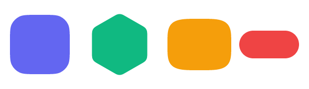
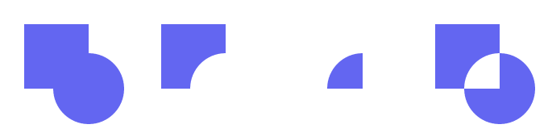
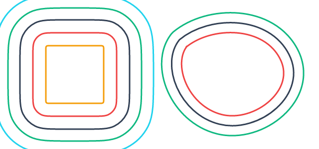
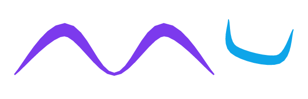

# Gallery

A tour of what svg-mcp can draw. Every image here was produced entirely from tool calls and
rendered with the built-in renderer — no hand-written SVG. See the [Cookbook](cookbook.md) for the
full, copy-pasteable code behind these.

## A composed icon

{width=420}

This single icon exercises most of the library at once:

- a **squircle** body filled with a linear **gradient**;
- a hexagonal **ring** made by `boolean` *difference* of two **rounded polygons**;
- a **superellipse** core;
- soft **glows** made by `offset_path` (grow the shape) + `apply_blur`, tucked behind the crisp art;
- **concentric** outlines, each an `offset_path` of the ring at a different distance.

## Parametric shapes

First-class, re-editable primitives — each stores its parameters, so an `edit_*` call re-derives it
without you touching path data:

- **`add_squircle`** — iOS/Figma corner-smoothed rounded rectangle (Apple's app-icon shape).
- **`add_rounded_polygon`** — the same corner smoothing generalized to N sides.
- **`add_superellipse`** — the Lamé curve `|x/rx|^n + |y/ry|^n = 1`; the exponent morphs it from
  diamond → ellipse → squircle → rectangle.
- **`add_pill`** — a stadium with fully rounded ends.

## Boolean operations

`boolean` combines shapes with **union / difference / intersection / exclusion**, realized with
native SVG constructs (clip, mask, evenodd compound path) — no extra dependency. Operands may be
composite groups. An even-width bezel is simply `difference` of an outer and inner squircle.

## Path offset

`offset_path` makes a parallel curve at a signed distance — concentric rings, even-width bezels,
glow outlines, stroke outlining. A squircle/pill/rounded-polygon is offset **exactly** by
regenerating its parameters (and stays editable); any other path uses an analytic cubic-Bézier
offset with round/miter/bevel joins. Positive distance grows, negative insets.

## Variable-width strokes

SVG strokes are constant width, so swelling/tapering lines — calligraphy, brush strokes, tapered
arrows — are drawn as a **fill**. `add_variable_width_path` expands a centerline with a per-vertex
width into a filled ribbon, with butt/round caps and optional cubic (Catmull-Rom) smoothing.

## Arrowheads

`define_arrow_marker` builds an endpoint head from a preset (triangle / barbed / stealth / diamond /
open / dot); `apply_marker` attaches it at the start, middle, or end. Heads are `orient="auto"`, so
they follow the path's tangent — note each arrow above points along its curve.
